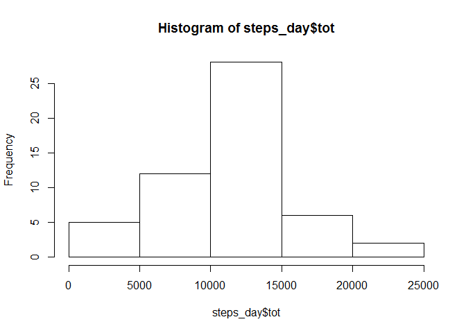
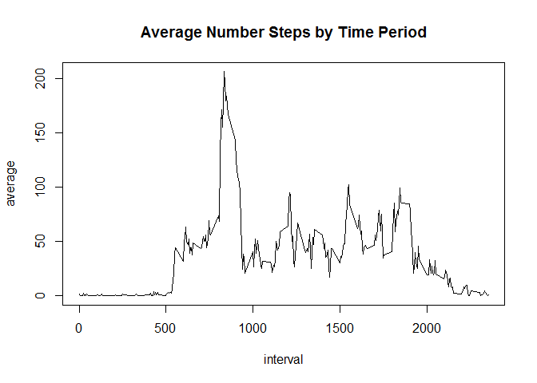
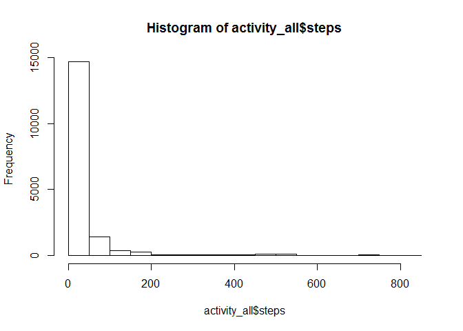
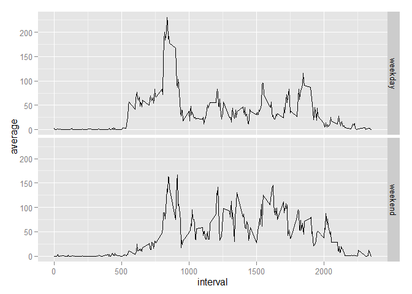

# Reproducible Research: Peer Assessment 1

This is the first project of the class Reproducible Research. The goal of this project is to makes use of data from a personal activity monitoring device. This device collects data at 5 minute intervals through out the day. The data consists of two months of data from an anonymous individual collected during the months of October and November, 2012 and include the number of steps taken in 5 minute intervals each day

The first step is to load the packages required during the completion of this exercise


```r
library(plyr)
library(ggplot2)
```

```
## Warning: package 'ggplot2' was built under R version 3.1.3
```

## Loading and preprocessing the data
Now we will load the data from the personal activity monitoring device from a csv file


```r
activity<-read.csv("activity.csv")
```

## What is mean total number of steps taken per day?
Then we will calculate the total of steps for each day and create and histogram of it.


```r
steps_day<-ddply(activity, c("date"), summarise, tot = sum(steps))
hist(steps_day$tot)
```

 

Now we will calculate and report the mean and median of the total number of steps taken per day.  
*Note for this part of the assignment we are removing any NA values*


```r
mean(steps_day$tot, na.rm=TRUE)
```

```
## [1] 10766.19
```

```r
median(steps_day$tot, na.rm=TRUE)
```

```
## [1] 10765
```

## What is the average daily activity pattern?

Now we will calculate the average daily activity and plot it 


```r
avg_step_interval<-ddply(activity, c("interval"), summarise, average = mean(steps, na.rm=TRUE))
with(avg_step_interval, plot(interval, average, type="l", main = "Average Number Steps by Time Period"))
```

 

Find the interval with the highest average activity


```r
avg_step_interval[avg_step_interval$average==max(avg_step_interval$average),1]
```

```
## [1] 835
```

## Imputing missing values

Calculate number of missing values on the data set


```r
length(which(is.na(activity$step)))
```

```
## [1] 2304
```

**We will replace missing values with the mean for that 5-minute interval**

To achieve this we will split the data into 2 groups those with values and those with missing values (NA's) once that is done we will populate the missing values with the average for the 5-minute interval and finally we will merger the two sets back together.


```r
activity_NA <- subset(activity, is.na(activity$steps))
activity_value<-subset(activity, is.na(activity$steps)==FALSE)

## Join sets to populate NAs with avg steps for that interval
activity_NA_value<-join(activity_NA,avg_step_interval)
```

```
## Joining by: interval
```

```r
#Replace NAs with avg per interval
activity_NA_value[,1]<-activity_NA_value[,4]

#Remove column "average"
activity_NA_value[,4]<-NULL

#Combine NA with populated sets

activity_value[,1]<-as.numeric(activity_value[,1])

activity_all<-rbind(activity_NA_value, activity_value)
```

We will make a histogram of the total number of steps taken each day and Calculate and report the mean and median total number of steps taken per day.

**We can observe that once we remove NAs the distribution of the data changes and shifts to a lot of values being in the lower range given that they were replaced with averages per interval**


```r
hist(activity_all$steps)
```

 

New mean now that the data has NAs removed


```r
mean(activity_all$steps, na.rm=TRUE)
```

```
## [1] 37.3826
```

New median


```r
median(activity_all$steps, na.rm=TRUE)
```

```
## [1] 0
```

## Are there differences in activity patterns between weekdays and weekends?

Now we will compare the data between weekday and weekends. For that effect we will create a factor variable that would tell us if a particular observation was made on a weekday or weekend. We will also calculate the avg number of steps per group (weekday and weekend) and interval and plot the alongside to compare and draw conclusions.


```r
##Convert date field to date data type

activity_all$date<-as.Date(activity_all$date)

##Add a column with the day of the week
activity_all$DayType<-weekdays(activity_all$date, abbr=TRUE)

##Substitute weekday for the keyword "weekday"

activity_all$DayType<-gsub("Mon|Tue|Wed|Thu|Fri" , "Weekday" ,activity_all$DayType)

##Substitute Sat and Sun for the keyword "weekend"
activity_all$DayType<-gsub("Sat|Sun" , "Weekend" ,activity_all$DayType)

##Convert DayType to Factor
activity_all$DayType<-as.factor(activity_all$DayType)

##Split Data by daytype
acivity_weekday<-activity_all[activity_all$DayType=="Weekday",]
acivity_weekend<-activity_all[activity_all$DayType=="Weekend",]

## Calculate mean for each group

acivity_weekday<-ddply(acivity_weekday, c("interval"), summarise, average = mean(steps, na.rm=TRUE))
acivity_weekend<-ddply(acivity_weekend, c("interval"), summarise, average = mean(steps, na.rm=TRUE))

## add back a coulmn with the daytype

acivity_weekday$DayType="weekday"
acivity_weekend$DayType="weekend"

##Combine both sets
activity_all_daytype<-rbind(acivity_weekday,acivity_weekend)

activity_all_daytype$DayType<-as.factor(activity_all_daytype$DayType)
library(ggplot2)

##Plot
g <- ggplot(activity_all_daytype, aes(x = interval, y = average))
#Plot
g + geom_line() + facet_grid(DayType ~ .)
```

 


### Conclusion

**It becomes apparent from the plot above that the average activity for this individual was higher during the weekdays that during weekdends**
